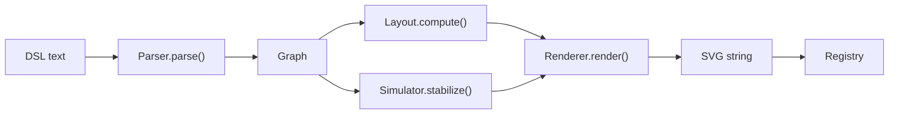
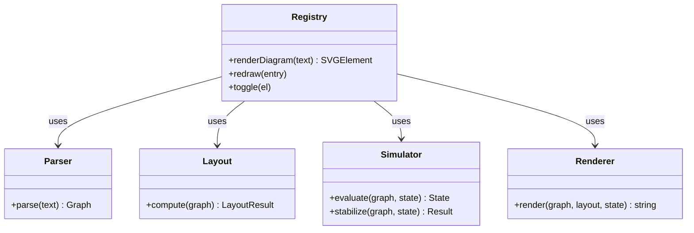

# logic-diagram.js Architecture

## Pipeline

The module processes DSL text through a linear pipeline:

## Objects

## Data Structures

### Graph
Produced by `Parser.parse()`. Describes the circuit topology.
- `inputs` — toggleable input nodes `{ id, type, label, init, stage, row }`
- `gates` — logic gates and wire nodes `{ id, type, ins[], stage, row }`
- `outputs` — output labels `{ id, ins[], label }`
- `labels` — static text annotations `{ text, stage, row }`
- `rects` — background rectangles `{ s1, r1, s2, r2 }`
- `nodes` — `Map<id, node>` for fast lookup during wire routing

### LayoutResult
Produced by `Layout.compute()`. Maps node ids to SVG pixel coordinates.
- `pos` — `Map<id, {x, y}>`
- `width`, `height` — SVG canvas dimensions in pixels
- `minRow` — lowest row value; used to offset negative rows into positive canvas space

### State
A `Map<id, 0|1|null>` owned by `Simulator`. `null` means the signal is unknown or unresolved (e.g. an undriven wire).
